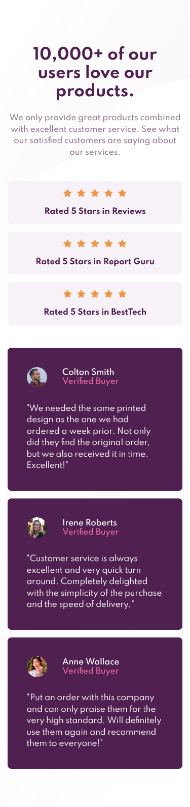
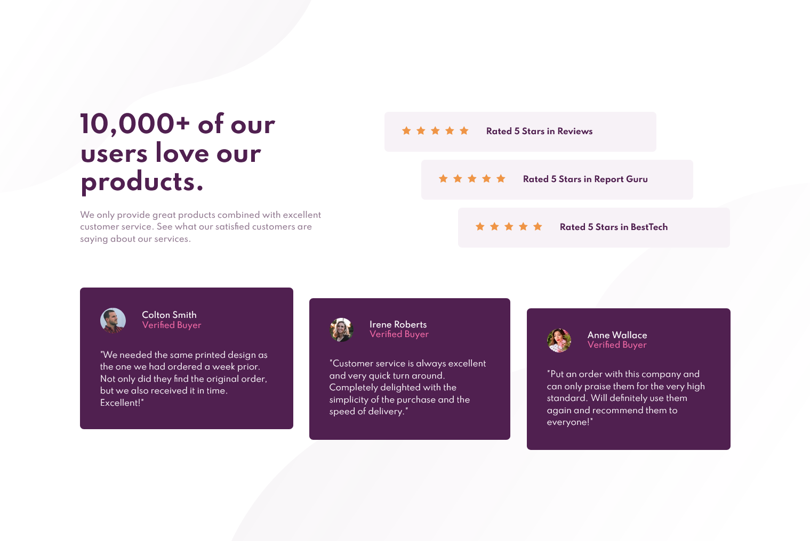

# Frontend Mentor - Social proof section


This is a solution to the [Social proof section challenge on Frontend Mentor](https://www.frontendmentor.io/challenges/social-proof-section-6e0qTv_bA). Frontend Mentor challenges help you improve your coding skills by building realistic projects. 

## Table of contents

- [Overview](#overview)
  - [The challenge](#the-challenge)
  - [Screenshot](#screenshot)
  - [Links](#links)
  - [Built with](#built-with)
  - [What I learned](#what-i-learned)
  - [Continued development](#continued-development)
  - [Useful resources](#useful-resources)
- [Author](#author)

## Overview

### The challenge

Users should be able to:

- View the optimal layout for the component depending on their device's screen size
- See hover states for all interactive elements on the page
- Hide/Show the answer to a question when the question is clicked

### Screenshot




### Links

- Solution URL: [Code solution](https://github.com/slickLink/faq-accordion-card-main)
- Live Site URL: [Live site](https://faq-accordion-card-main-solution.netlify.app/)

### Built with

- Semantic HTML5 markup
- SCSS
- Flexbox
- Mobile-first workflow


**Note: These are just examples. Delete this note and replace the list above with your own choices**

### What I learned

- overflow css property:
The child nodes of any parent element with a overflow property cannot overide its behavior.
```html
<div class="container">
  
</div>
```
```scss
.container {
  overflow: hidden;
  img {
    width: 100%
    margin-left: -20em; 
  }
}
// image will be cut off at the left border of the div
```

- :target css selector:
URLs with an # followed by an anchor name link a certain element within the document. the element being linked to is the :target element.

Example from this project
```html
<div id="question1" class="faq-content-item">
  <a href="#question1" class="question-wrapper">
      <p class="faq-content-question">How many team members can I invite?</p>
      
  </a>
  <p class="faq-content-answer">You can invite up to 2 additional users on the Free plan. There is no limit on 
      team members for the Premium plan.</p>
</div> <!--FAQ question and answer item-->
```
The <a> tag links the outer div with id "question1". I did this so could select the elements inside .faq-content-item with css and create a toggle without using js :)

*Note: not entire code only important parts for sample*
```scss
.faq-content-answer { // FAQ answer <p>
  display: none;
  margin: 0em 3em 1em 0;
  color: $text_light;
}

// css only toggle using :target
:target {
    .faq-content-question { // clicked question
        color: black;
        font-weight: 700;
    }
    .arrow {
        transform: scaleY(-1);
    }
    .faq-content-answer {
        display: block;
    }
}
```
### Continued development

- keep solidifying my knowledge in css and html 
- eager to learn Grid
- Develop a sense of when to use Grid and/or Flexbox

### Useful resources

- [MDN](https://developer.mozilla.org/en-US/) - Probably the best resource out there
- [w3schools.com](https://www.w3schools.com/cssref/sel_target.asp) - Certified Gold

## Author

- Frontend Mentor - [@slickLink](https://www.frontendmentor.io/profile/slickLink)